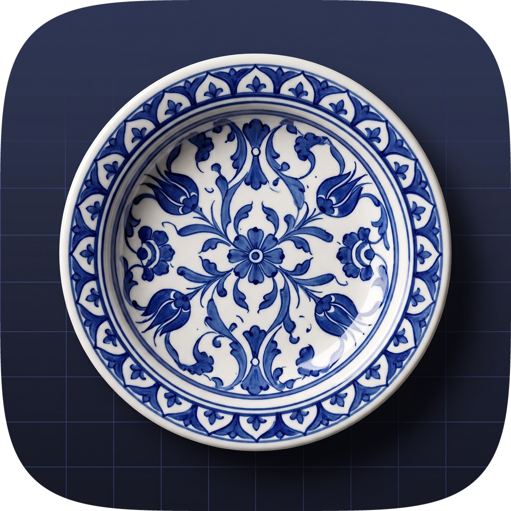
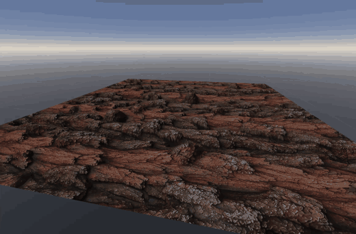
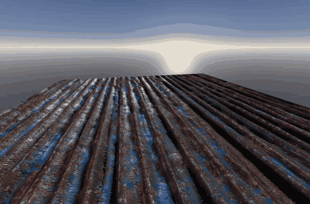
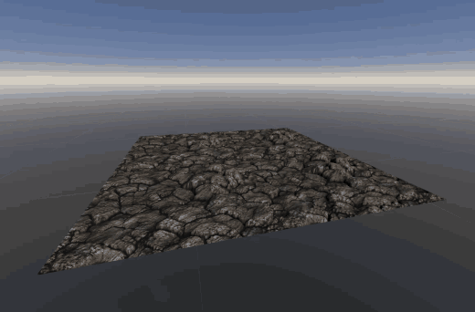

<p align="center">
  
</p>

<h1 align="center">PBRCELAIN</h1>

<p align="center">
  <strong>Turn a single photo into a clean, tileable height map — and a full PBR material around it.</strong>
</p>

<p align="center">
  <a href="https://buymeabitcoffee.vercel.app/btc/bc1qhae9un6j8mel5xcrd4trajm65wfunlltkzelh7?identifier=Buy+Me+a+Coffee"></a>
</p>

PBRCELAIN is a PyQt6 desktop app built around one job: extracting high-quality
height maps from ordinary material photos (stone, brick, wood, tiles, fabric…)
using state-of-the-art monocular depth estimation, then correcting the typical
artifacts those models produce. Normal, Roughness and Ambient Occlusion maps are
derived from the resulting height map, and everything can be inspected live on a
3D preview.

Inspired by Substance 3D Sampler, Materialize and Quixel Mixer, but deliberately
simpler: one material, one window.

## Showcase

Materials generated from single photos, previewed in the built-in 3D viewport
(height-driven parallax, normal, roughness and AO under the default sky).

<p align="center">
  <br>
  <em>Tree bark</em>
</p>

<p align="center">
  <br>
  <em>Rusty painted metal, on a plane and a cube</em>
</p>

<p align="center">
  <br>
  <em>Cracked stone</em>
</p>

<p align="center">
  <sub>Source textures for the demos from <a href="https://polyhaven.com">Poly Haven</a> (CC0) — thank you!</sub>
</p>

## Height map generation

### Depth models

| Family | Variants | Character |
| --- | --- | --- |
| **Depth Anything V2** | Small / Base / Large | Fast, stable relative depth; great general-purpose default. |
| **Marigold** | LCM (fast) / v1.1 | Diffusion-based; exceptional micro-relief on joints, grain and organic surfaces. |

Models are downloaded from Hugging Face on first use and can run on **CUDA GPUs**,
**Apple Silicon (MPS)** or **CPU**. If a GPU is explicitly selected but not
available, the app reports why (e.g. a CPU-only PyTorch build) instead of
silently falling back to CPU.

### Chunk estimation (high-resolution detail)

A single model pass squeezes the whole photo into the model's native input size
(518 px for Depth Anything, 768 px for Marigold), which smears fine detail on
large images. Chunk estimation instead:

1. runs one full-image pass as a trusted large-scale reference,
2. re-runs the model on overlapping crops near its native resolution,
3. calibrates each crop's scale/offset to the reference (least-squares fit),
4. cross-fades the crops back together.

**Effort** (ultra / high / medium / low) controls the chunk size, **Batch size**
processes several chunks per forward pass on GPUs with enough VRAM, and the
height map refines live on screen while chunks are processed.

### Seamless (tileable) generation

With **Seamless** enabled, the source is expanded into a 3×3 tiled canvas before
inference, so the model sees real neighboring content across every edge. The
result is cropped back and the borders and corners are blended so the height map
tiles with no visible seam. **Force seamless with blur** additionally softens hard
seams in the source photo before the depth model runs.

### Correcting depth-model artifacts

Monocular depth models are trained on perspective scenes, so on flat material
photos they tend to add a large-scale "bowl" or "dome" shape. The Adjustment page
fixes this and shapes the relief — all non-destructively, on the raw depth data:

- **Flatten curvature** — remove bowl/dome (quadratic fit), remove tilt (plane
  fit), high-pass, or keep raw depth.
- **Bowl correction curve editor** — separate X / Y curves that control how much
  correction is applied at each distance from the center, with live preview.
- **Relief & crevice calibration**
  - *Local equalization* levels regional lighting and tilt differences so all
    features sit on the same base plane.
  - *Crevice depth* pushes mortar lines and joints down and lifts the surfaces
    between them (or softens them with negative values).
  - *Albedo guidance* uses edges in the source photo to keep joints at the bottom.
- **Fine tuning** — invert, gamma, smoothing, percentile clipping (low/high),
  post-process seamless wrap.
- **Output** — 8-bit PNG, 16-bit PNG or 32-bit float OpenEXR.

Edits preview instantly on a downscaled copy; **Save** commits them at full
resolution, **Revert** discards them. The raw depth field is stored in the
project file, so height adjustments stay editable after reopening a project
without re-running the model.

## Derived maps

- **Normal** — Sobel-gradient normal map from the height map, with engine presets
  (OpenGL / Blender / Unity +Y, DirectX / Unreal −Y), strength, pre-smoothing, a
  multi-frequency mixer (macro / medium / micro detail) and optional photo-grain
  injection from the albedo.
- **Roughness** — estimated from local normal variance (Toksvig-style), with
  material presets, height-cavity and albedo-contrast blending, and a painter for
  hand-drawn wear, rust or glossy areas. This is a heuristic starting point, not a
  measurement of real surface roughness.
- **Ambient Occlusion** — ray-traced over the height field as a real 3D surface:
  you give its real-world scale (surface width and maximum depth) and each
  pixel's sky visibility is traced in 4–16 directions, so crevices darken by
  their actual depth and width and the result looks the same at any resolution.
  The original fast approximation remains available as the *Classic* method
  (projects saved before keep using it). Strength, contrast, 8/16-bit output.
- **Curvature** — exported alongside the other maps (optional, in the AO
  panel): mid-grey is flat, brighter marks edges and ridges, darker marks
  cavities; the usual mask for edge wear and dirt in material graphs.
- **Albedo** — used as uploaded, with optional auto white balance, color-range
  shifting and seamless edge blending.

Any map can also be uploaded directly instead of generated.

## 3D preview

Real-time OpenGL preview on a sphere, cube or plane using a Cook-Torrance / GGX
shader (albedo, normal, roughness, AO), plus **Parallax Occlusion Mapping** driven
by the height map. Camera, lighting and display settings live in a separate View
Options panel. Double-click any map to inspect it in a 2×2 tiled view to check for
seams.

## Installation

```bash
python -m venv venv
venv\Scripts\activate
```

For NVIDIA GPU acceleration, install the CUDA build of PyTorch **before** the
requirements:

```bash
pip install torch torchvision --index-url https://download.pytorch.org/whl/cu126
```

```bash
pip install -r requirements.txt
```

On Apple Silicon, the standard `pip install torch torchvision` includes MPS support.

## Running

```bash
venv\Scripts\python main.py
```

Always start the app with the venv's Python so the correct PyTorch build is used.
A project can be opened directly: `venv\Scripts\python main.py my_material.pcln`

### Start menu shortcut and `.pcln` association (Windows)

```bash
venv\Scripts\python register_file_association.py
```

This associates `.pcln` with PBRCELAIN for the current user only
(`HKEY_CURRENT_USER`, no admin rights needed) and adds a PBRCELAIN shortcut to
the Start menu. The app starts without a console window and writes its output to
`%LOCALAPPDATA%\PBRCELAIN\pbrcelain.log`. Re-run the command if you move the
project folder; remove the association and the shortcut with `--unregister`.

### macOS app bundle and `.pcln` association

```bash
venv/bin/python build_macos_app.py
```

This installs a `PBRCELAIN.app` launcher in `~/Applications` that runs this
project folder with the venv's Python. The app shows up under its own name and
icon in the Dock, Launchpad and Spotlight, and double-clicking a `.pcln` file in
Finder (or dropping one on the Dock icon) opens it. Output goes to
`~/Library/Logs/PBRCELAIN/pbrcelain.log`. Re-run the command if you move the
project folder or recreate the venv; remove the app with `--uninstall`
(`--dest DIR` installs elsewhere, e.g. `/Applications`).

### Platform look and input

On macOS and Windows the interface follows the system Light/Dark appearance and
accent color, in each platform's own design language: macOS controls with the
menu bar at the top of the screen, and Windows 11 (Fluent) controls with a
themed title bar and an in-window command bar. Window size and section split are
remembered between sessions, and recent projects are one click away (**File →
Open Recent** on macOS, the arrow next to **Open** on Windows).

Trackpads work in the 3D viewport, tiled preview and imperfection painter:
pinch to zoom and swipe with two fingers to orbit (3D) or pan. The imperfection
painter also takes pen input (Wacom, Surface Pen): pressure sets brush size and
flow, and the pen's eraser end erases. On Windows, long jobs show progress on
the taskbar button.

### App icon

The icon artwork lives in `ui/assets/app_icon_source.jpg`. After replacing it,
run `python make_icons.py` to regenerate the squircle icons (`app_icon.png`,
`app_icon.ico` for Windows, and the macOS version on Apple's icon grid), then
re-run `build_macos_app.py` on macOS.

## Project files (`.pcln`)

Work is saved as a `.pcln` project: a zip archive holding the source images,
generated maps, the raw depth data and every parameter. Reopening a project
restores everything without re-running the depth model. A `.zip` with the same
layout (e.g. a renamed `.pcln`) opens as a project too.

Commands (the File menu on macOS, the command bar on Windows): **New Project /
Open Project / Open Recent / Save / Save As / Export Maps**.
**Export Maps** writes every available map to a folder (PNG, or EXR for 32-bit
height maps), plus `curvature.png` when a Height map exists.
